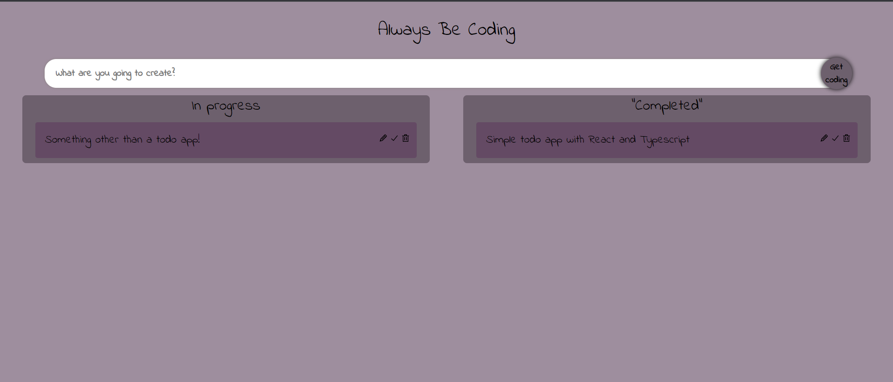
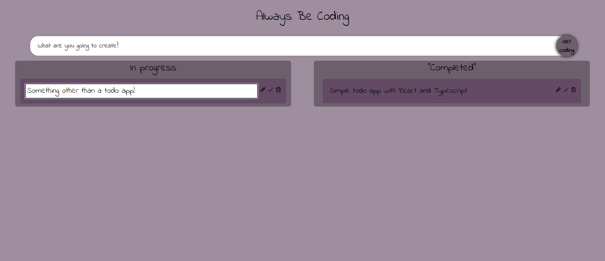
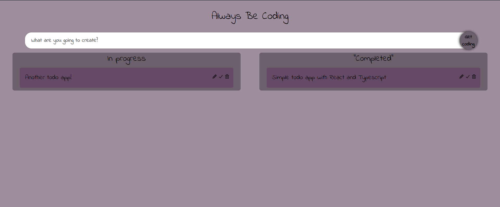
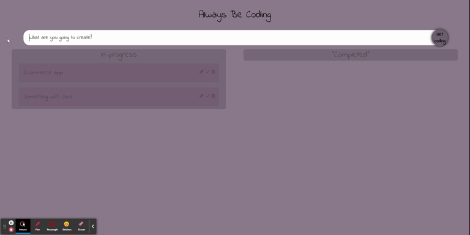

# anotherTODO-ABC

 ## Description

_Welcome to anotherTODO! This application was created with React using Typescript. I wanted a project on the easier side to learn how to use Typescript but I did not get what I bargained for. I had quite a few issues with dependencies and React 18. Only way I found past the issues was to use `npm install your-packages --legacy-peer-deps` I am currently unsure what this does (other than worked) and need to research it more._ 

This application:
* is currently deployed on [GH-Pages](https://amber-robeck.github.io/anotherTODO/ "Link to deployed page") 
* is just another todo app in the long quest of creating a million todo apps but this time using Typescript instead of plain Javascript. 
* users are currently able to ADD, EDIT, DELETE and MOVE a task.

Future development goals:
* Save tasks, probably local storage
* Strikethrough tasks when user moves to completed
* Make mobile responsive

---

  ## Table of Contents
  
  - [Usage](#usage)
  - [Installation](#installation)
  - [Screenshots](#screenshots)
  - [Technologies](#technologies)
  - [License](#license)
  - [Contributions](#how-to-contribute)
  - [Questions](#questions)

  ---

  ## Usage

Use this application to create and organize your tasks.

---

  ## Installation

This project is ran through Node.js, using an express server.
* `clone the repository` 
*  `npm install` in the command line to install the required dependencies. 
*  open in the terminal and then `npm run start` to start the server!
*  The server will start on `localhost:3001`

  ---

  ## Screenshots

Here are some screen shots of this application.

    

  ---

  ## Technologies

  * VS Code
  * React 18
  * Typescript
  * Css
  * [React-beautiful-dnd](https://www.npmjs.com/package/react-beautiful-dndf "Link to react-beautiful-dnd") 
  

  ---

  ## License

   MIT License

Copyright (c) [2022] [Amber Robeck]

Permission is hereby granted, free of charge, to any person obtaining a copy
of this software and associated documentation files (the "Software"), to deal
in the Software without restriction, including without limitation the rights
to use, copy, modify, merge, publish, distribute, sublicense, and/or sell
copies of the Software, and to permit persons to whom the Software is
furnished to do so, subject to the following conditions:

The above copyright notice and this permission notice shall be included in all
copies or substantial portions of the Software.

THE SOFTWARE IS PROVIDED "AS IS", WITHOUT WARRANTY OF ANY KIND, EXPRESS OR
IMPLIED, INCLUDING BUT NOT LIMITED TO THE WARRANTIES OF MERCHANTABILITY,
FITNESS FOR A PARTICULAR PURPOSE AND NONINFRINGEMENT. IN NO EVENT SHALL THE
AUTHORS OR COPYRIGHT HOLDERS BE LIABLE FOR ANY CLAIM, DAMAGES OR OTHER
LIABILITY, WHETHER IN AN ACTION OF CONTRACT, TORT OR OTHERWISE, ARISING FROM,
OUT OF OR IN CONNECTION WITH THE SOFTWARE OR THE USE OR OTHER DEALINGS IN THE
SOFTWARE.

  
  ---
  
  ## How to Contribute

     However you would like to contribute I always look forward to learning something new, feel free to email me!

  [Contributor Covenant](https://www.contributor-covenant.org/)

  ---

  ## Questions

* OR here

 

* OR here

